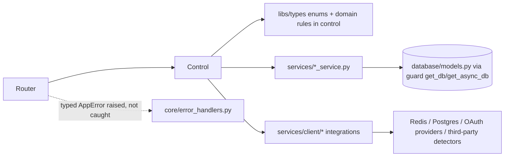

# SEMD Backend — Target Architecture

Builds on `SEMD_BACKEND_CURRENT_STATE.md`. This document defines the target structure and layer contracts; `SEMD_BACKEND_REFACTOR_ROADMAP.md` sequences the migration. No production code changes in this document.

## Architecture principle: evolve, don't replace, the module layout

The current-state audit found the codebase **already implements a feature-oriented layered monolith**: one file per domain in each of `routers/`, `control/`, `services/`, `models/`, with a strict `routers -> control -> services -> database` dependency direction that is *mostly* honored today (the main violations found were duplicated error-handling boilerplate in routers, not business logic leaking into routers). There is no evidence in this repo of a need for separate deployable services beyond the existing, deliberate split with `semd-ml` over Redis.

Per the mandate's own instruction ("adapt the example tree to current project size... avoid unnecessary abstraction") and the prohibition on rewriting the whole backend at once: **the target architecture keeps the existing top-level layout** (`routers/`, `control/`, `services/`, `models/`, `database/`, `guard/`, `libs/`, `workers/`) rather than migrating to the `app/modules/<domain>/` tree sketched as an example in the mandate. Introducing that tree here would mean moving ~150 files for no behavioral gain — the domain boundaries the mandate's example tree is trying to achieve already exist, just as parallel same-named files across four folders instead of one folder per domain. A folder-per-domain reorg is listed as a possible **future** improvement (§5) but is explicitly **not** part of this roadmap, since "large file moves" and "behavior changes" must not be combined per the mandate's migration rules, and a pure file-move has no acceptance-testable behavior change to justify its own risk right now.

What the target architecture *does* add is the machinery this layout is currently missing: a `core/` package for cross-cutting concerns, and hardening within each existing layer.

## 1. Target module tree

```
semd-backend/
├── main.py                      # becomes: import create_application, no side effects beyond that
├── application.py                # NEW — create_application() factory (see §3)
│
├── core/                         # NEW package
│   ├── config.py                 # Settings, relocated from config/settings.py (or config/ kept, re-exported)
│   ├── logging.py                # NEW — structured logging + request-ID setup
│   ├── security.py                # NEW — SSRF/URL-safety validators, shared crypto helpers
│   ├── middleware.py              # NEW — request-ID middleware, access-log middleware
│   ├── exceptions.py              # NEW — typed AppError hierarchy (see ADR-0002)
│   ├── error_handlers.py          # NEW — FastAPI exception_handler registrations
│   └── health.py                  # NEW — /health/live, /health/ready
│
├── database/                     # unchanged location; models.py gains ForeignKey()/relationship()
├── guard/                        # unchanged — AuthGuard, get_db/get_async_db already match target
├── libs/                         # unchanged — enums, pagination, shared types
├── routers/                      # unchanged domain split; each router's try/except collapses to
│                                  #   "let core/error_handlers.py catch it" (see ADR-0002)
├── control/                      # unchanged — already the application-service layer
├── services/                     # unchanged domain split; services/redis_client.py and
│                                  #   services/postgres_client.py (stale copies) removed once
│                                  #   workers/prediction_worker.py is migrated to services/client/*
├── models/                       # unchanged — Pydantic schemas; Any-typed response fields
│                                  #   (prediction_response.py, report_response.py, ml_response.py)
│                                  #   get concrete field types
├── workers/                      # unchanged — prediction_worker.py import fixed to services/client/
└── tests/                        # already exists (WIP) — grows per-feature per Phase 4
```

This is intentionally a thin layer on top of the existing tree, not a parallel structure. `routers/`, `control/`, `services/`, `models/`, `database/` keep their current per-domain filenames (`auth`, `ml`, `prediction`, `report`, `setting`, `stat`, `dashboard`, `queue`) — those *are* the feature module boundaries the mandate asks for.

## 2. Layer responsibilities (target, mapped to existing code)

| Layer | Current state | Target |
|---|---|---|
| `routers/*_route.py` | Owns HTTP routing + a duplicated `try/except Exception -> HTTPException(500, str(e))` in 61 places | Owns HTTP routing, dependency injection, request/response schemas only. No try/except for generic errors — typed exceptions raised by `control/`/`services/` propagate to `core/error_handlers.py`. Routers may still catch and re-raise specific, already-typed `HTTPException`s they intentionally want to pass through unchanged. |
| `control/*_control.py` | Already the use-case/orchestration layer — this is correct today and does not need structural change | Same responsibilities; gains: raises typed `AppError` subclasses (`core/exceptions.py`) instead of raw `HTTPException` where the error represents a business rule, not a transport concern. `PredictionControl` gains the URL-safety validation step (SSRF/scheme checks) before dispatch, per the current-state audit's §7.2 finding. |
| `services/*_service.py` | DB/Redis/third-party I/O — correct today; the two duplicated `redis_client.py`/`postgres_client.py` pairs are the one real defect | Same; stale copies removed, `workers/prediction_worker.py` imports the canonical `services/client/redis_client.py`. `MLServiceClient.get_job_result()`'s blocking `time.sleep` poll becomes `asyncio.sleep` inside an actually-async call path (or moves to `asyncio.to_thread` if a sync boundary must remain), so it stops blocking the event loop. |
| `models/*_model.py`/`*_response.py`/`*_request.py` | Pydantic schemas, mostly typed; a handful of `Any` fields in public response models | Same; the `Any` fields identified in the audit (§6) get concrete types. All response models continue inheriting `BaseResponseModel` — that high fan-in is correct, not coupling debt. |
| `database/models.py` | SQLAlchemy models with zero `ForeignKey()`/`relationship()`, out of sync with `semd.db.sql`'s real constraints | `ForeignKey()` added to match `semd.db.sql`; `relationship()` added only where a repository actually needs eager/joined loading (avoid adding relationships nobody queries through, to not overload the session with unnecessary joins) |
| `core/exceptions.py` + `core/error_handlers.py` | Does not exist | New typed `AppError` hierarchy (`NotFoundError`, `ValidationError`, `PermissionError`, `ConflictError`, `ExternalServiceError`, etc.) + a small number of `@app.exception_handler(...)` registrations in `application.py` that convert them to the RFC-7807-flavored response shape from the mandate (`type`/`title`/`status`/`code`/`detail`/`instance`/`request_id`/`errors`). See ADR-0002. |
| `core/security.py` | Does not exist | Houses the SSRF/URL-safety validator (reject loopback/private/link-local/metadata-endpoint hosts, reject unsupported schemes, reject embedded credentials, resolve encoded hosts) called from `control/prediction_control.py` before any URL is queued or handed to a third-party executor. |
| `core/middleware.py` | Does not exist | Request-ID generation (or passthrough of an inbound `X-Request-ID`), attached to `request.state` and to the structured log context and to error responses' `request_id` field. |
| `core/health.py` | `GET /health` returns hardcoded fake metrics, no dependency checks | `GET /health/live` (process up, no dependency calls) and `GET /health/ready` (checks Postgres + Redis reachability; does not depend on optional third-party detectors) |

## 3. Application factory

`main.py` currently builds `app = FastAPI(...)` at module scope and writes `openapi.yaml` to disk as an import-time side effect (`main.py:24-92`). Target:

```python
# application.py
def create_application() -> FastAPI:
    app = FastAPI(...)
    configure_middleware(app)
    configure_exception_handlers(app)
    register_routers(app)
    return app
```

`main.py` becomes a thin entrypoint: `app = create_application()` plus the existing `dev`/`prod` CLI. The `openapi.yaml`-on-import side effect moves to an explicit `make openapi` target (`python -c "from application import create_application; import yaml; yaml.dump(create_application().openapi(), ...)"`) — generating the file becomes a deliberate action, not an unconditional side effect of every import (which today fires on every test collection, every dev-server reload, every `python -c` invocation).

## 4. Dependency direction



`control/` does not import FastAPI's `Request`/`Response`/`HTTPException` in the target state (it raises `core.exceptions.AppError` subclasses instead); only `routers/` and `core/error_handlers.py` touch FastAPI/HTTP types directly. This is the one real dependency-direction fix needed — today `control/` and even some `services/` code raises `fastapi.HTTPException` directly, coupling business logic to the transport layer.

## 5. Deferred / explicitly out of scope for this roadmap

- **Full `app/modules/<domain>/` folder-per-feature reorg** — see rationale above. Revisit only if a concrete pain point (e.g., a domain outgrowing single-file services/control) emerges.
- **Repository-pattern abstraction (`repository.py` per domain, `Protocol`-based interfaces)** — `services/*_service.py` already plays this role for most domains. Introducing a formal `Protocol` layer is worth doing where a service currently mixes DB queries and third-party I/O in one class (e.g., `service_conf`-adjacent code), but this should be decided per-feature during Phase 4, not mandated globally up front.
- **Removing the ORM/DDL drift by adopting Alembic** — recommended (see roadmap), but sequencing a migration tool introduction is its own project-level decision the user should confirm before Phase 3 work begins, since it changes the deployment/ops story (`database/semd.db.sql` init-script bootstrap vs. versioned migrations).

## 6. Decisions recorded

See `docs/backend/adr/0001-backend-module-architecture.md` (keep existing per-domain flat layout, add `core/`) and `docs/backend/adr/0002-error-response-format.md` (typed `AppError` + centralized handlers, RFC-7807-flavored shape).
