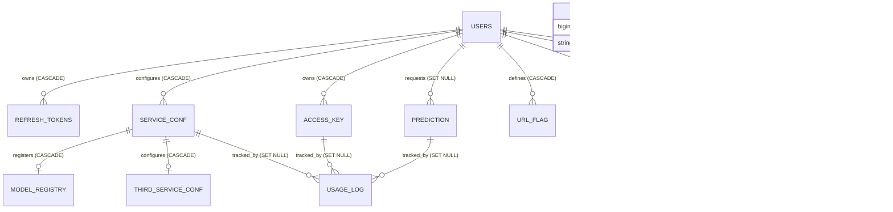

# ER Diagram (as-implemented)

Reflects `database/models.py` post-Phase-3 `ForeignKey()` additions, cross-checked against `database/semd.db.sql`'s actual DDL constraints.

`SYSTEM_CONFIG` has no foreign keys in or out — shown standalone for completeness (config_key/value pairs, admin-managed via `/setting/system-config`).

Not shown as a relationship (no FK exists): `USAGE_LOG` and `PREDICTION`/`URL_REPORT`/`URL_FLAG` are all conceptually linked to "which URL was evaluated," but there is no `url` foreign-key table — `url` is a plain `Text` column repeated across `prediction.url`, `url_flag.url`, `url_report.url`, with no shared `url_record` entity the way the master prompt's example ER diagram assumed (`URL_REPORT }o--|| URL_RECORD`). Confirmed: no such table exists in this schema.
