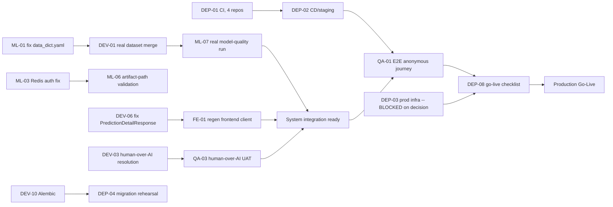

# SEMD Monday.com Roadmap — Existing-Task Review (2026-07-29, review-only pass)

Status: **REVIEW ONLY — no Task created or modified in this pass.** Per this
prompt's explicit gate (§11/§13), this is the checkpoint + proposal; execution
waits for approval. (Contrast with the prior same-day pass, which had explicit
user authorization to proceed straight to writes — this one doesn't, so it stops
here.)

## A. Board summary (verified live, 2026-07-29)

Total Tasks: **59** (confirmed via `get_board_items_page`, matches the ~59
stated in this prompt).

**By Epic:**
| Epic | Count |
|---|---|
| Rewrite Document Plan | 17 |
| Web API | 11 |
| ML | 10 |
| Deployment | 10 |
| Extension | 6 |
| Web App | 5 |

**By Status:** Ready to start 53, Stuck 4 (`DEV-08`, `DEV-13`, `ML-02`, `DEP-03`
— all genuine product/infra decisions, not stalled work), In Progress 2
(`DEV-05`, `DEV-07` — both correctly reflect real partial completion, see
their descriptions for exact commit hashes). Waiting for review / Pending
Deploy / Done: 0.

**By Priority:** Critical 22, High 18, Medium 13, Low 4, Best Effort 2.

**By Type:** Feature 31, Test 16, Bug 12.

**Tasks without an Epic:** 0 — every item links to exactly one Epic, verified.

**Tasks without a Mermaid diagram: 59 of 59 (100%).** This is a real,
board-wide gap, not specific to any cohort — it predates this session (the
original 17 DOC + 4 DEV tasks never had diagrams either) and the 35 tasks
created earlier today followed that same established precedent rather than
this prompt's full template. See §D for the recommendation (do not
blanket-retrofit; add per-task when picked up for implementation).

**Structured dependencies: the board has no dependency column at all** —
`task_epic` (board_relation) is the only relational column; every
"Dependency:"/"Depends on X" reference on any task (old or new) is prose
inside the Description field, not a queryable link. This is a board-structure
limitation, not a per-task defect — flagged once here rather than repeated
59 times.

**Tasks self-flagged as needing repository verification before their scope
can be trusted:** `FE-04`, `EXT-01`, `EXT-03` (each explicitly says in its own
description that the referenced docs weren't read in full this pass), `ML-08`
(explicitly says its premise — whether drift monitoring already exists in
`src/monitoring/store.py` — wasn't checked). 4 tasks.

## B. Existing-task review matrix

**Cohort 1 — 17 `DOC-0X`/`DOC-R0X` tasks (Rewrite Document Plan epic, pre-existing
before this session).** Classification: **Valid — Needs Expansion** (all 17,
uniformly). Correct scope, real academic-thesis workflow, dense Thai
description + inline `Dependency:`/`Definition of Done:` lines already present
— but no Mermaid diagram, no explicit English half (Thai-only body, not the
TH/EN split this prompt's format wants), no separately-enumerated acceptance
criteria. Recommended action: **Keep** — do not blanket-rewrite 17 already-
functional tasks just to retrofit format; expand individually only when
actually picked up for execution. No repository-verification concern (these
are writing/analysis tasks, not implementation-status claims).

**Cohort 2 — `DEV-01`, `DEV-02` (ML epic, pre-existing).**
- `DEV-01` (real-dataset merge/provenance manifest) — **Valid — Ready**.
  Re-confirmed accurate this session: `dataset/raw/merged.csv` is still the
  20-row `t093_smoke_fixture.csv` artifact (`merged.metadata.json` verified
  directly).
- `DEV-02` (leakage-safe evaluation + security metrics) — **Partially
  Completed, description now stale — real finding, missed in the earlier
  batch.** Verified directly in code this session: `StratifiedGroupKFold`
  grouped on `registered_domain` (`src/data/splitters.py`,
  `src/data/dataset_pipeline.py:194-220`) and full metric computation
  (`confusion_matrix`, FPR, FNR, latency — `src/ml/evaluation.py`) already
  exist and appear correctly wired. The task description doesn't reflect this
  — it reads as if the pipeline needs to be built, when the more accurate
  remaining scope is "run it for real" (which is what `ML-07`, created
  earlier today, actually covers). **Recommended action: Update `DEV-02`'s
  description** the same way `DEV-05`/`DEV-06`/`DEV-07` were updated earlier
  today, and cross-link it to `ML-07`. This should have happened in the same
  pass as those three and didn't — flagging it now rather than silently
  leaving it stale.

**Cohort 3 — `DEV-03`, `DEV-04` (Web API epic, pre-existing).**
Classification: **Valid — Ready**, both. Re-confirmed against
`docs/backend/features/url-flags-whitelist/README.md:30` and the
advisor-feedback doc: neither `url_flag` nor `url_report` overrides the
detector verdict, and the retrain queue is still pushed unconditionally. No
new evidence contradicts either task.

**Cohort 4 — `DEV-05`, `DEV-06`, `DEV-07` (updated earlier today).**
Classification: `DEV-05` **Partially Completed** (accurate, In Progress
correctly set), `DEV-06` **Valid — Ready** (root cause fully diagnosed,
correctly still Ready to start since no fix has been written), `DEV-07`
**Partially Completed** (accurate, In Progress correctly set). No further
action.

**Cohort 5 — 35 tasks created earlier today** (`DEV-08`..`DEV-13`, `ML-01`..`ML-08`,
`FE-01`..`FE-04`, `EXT-01`..`EXT-06`, `DEP-01`..`DEP-08`, `QA-01`..`QA-03`).
Classification: **Valid — Needs Expansion**, uniformly — every claim in every
one of these was verified against a file path, commit hash, or command output
at creation time (not re-verified again in this pass, since nothing in the
codebase has changed in the interim), but none carry a Mermaid diagram,
enumerated Given-When-Then acceptance criteria, or a TH/EN split. Secondary
classification **Blocked by Decision** on 4 of them: `DEV-08`, `DEV-13`,
`ML-02`, `DEP-03` (all correctly marked Stuck already). Recommended action:
**Keep as-is** — same reasoning as Cohort 1, this matches the board's own
established precedent (dense paragraph + Definition of Done, not the full
17-section template) rather than a shortcut invented for this review.

**No duplicates found** across all 59 — checked new-task titles/outcomes
against each other and against the pre-existing 24 before creating them
earlier today; re-scanned this pass, nothing changed.

## C. Coverage matrix (Go-Live capabilities vs. existing Tasks)

| Capability area | Coverage | Evidence |
|---|---|---|
| ML dataset provenance/leakage-safe eval | Partially covered | `DEV-01`, `DEV-02` (stale desc, see B), `ML-01`, `ML-02`, `ML-07` |
| ML registry/promotion/rollback/MLflow | **Fully covered by existing code**, not a Task gap | Verified live in `semd-ml/docs/final-handoff.md` §4-5; `ML-05`/`ML-06`/`ML-08` cover the residual issues, not a rebuild |
| Backend auth/authz | Covered by completed prior audit | `docs/backend/SEMD_BACKEND_FINAL_HANDOFF.md`; no open Task needed beyond `DEV-08` (the one undecided piece) |
| Human-over-AI verdict resolution | Covered | `DEV-03`, validated by `QA-03` |
| Retraining gate | Covered | `DEV-04` |
| Audit logging | Covered | `DEV-09` (new) |
| Schema migrations (Alembic) | Covered | `DEV-10` (new) |
| API contract drift (frontend/backend) | Covered | `DEV-06`, `FE-01`, `QA-02` (new) |
| Frontend test coverage | Covered | `FE-02` (new) — was a total gap before |
| Extension anonymous/access-code state | Covered | `DEV-05`, `EXT-06` (new) |
| Extension test/store/privacy | Covered | `EXT-01`..`EXT-05` (new) — epic had zero Tasks before today |
| CI/CD across all 4 repos | Covered | `DEP-01`, `DEP-02` (new) — **was total void**, confirmed via repo-wide search: only workflow anywhere is `semd-backend`'s review-bot |
| Production infra/TLS/domain | **Blocked by decision** | `DEP-03` (Stuck) |
| Observability/alerting | Covered | `DEP-05` (new) |
| Backup/restore, rollback rehearsal | Covered | `DEP-04`, `DEP-07` (new) |
| Cross-service E2E / UAT | Covered | `QA-01`, `QA-03` (new) |
| Go-live checklist | Covered | `DEP-08` (new) |
| **Data Engineering as its own workstream** | **Not separately covered** | Folded into ML epic per the collapsed epic mapping decided in the prior pass (`monday-roadmap-checkpoint.md` §4) — no separate Data epic exists on the board |
| **Security & Privacy as its own workstream** | **Partially covered, split across epics** | SSRF/authz already fixed (backend audit); rate limiting (`DEV-07`), extension privacy disclosure (`EXT-05`), permission review (`EXT-02`) — no standalone Security epic exists, same collapsed-mapping decision |

## D. Proposed actions

- **Keep unchanged:** Cohort 1 (17), Cohort 3 (2), Cohort 4 (3) = 22 tasks.
- **Update:** `DEV-02` only (1 task) — stale description, see B.
- **Expand (deferred, not now):** Cohort 5's 35 tasks + Cohort 1's 17 —
  add Mermaid diagrams / GWT acceptance criteria individually when each is
  actually picked up for implementation, not as a blanket retrofit pass.
- **Split / Merge / Move / Close:** none proposed — no duplicates, no
  wrong-Epic links, nothing obsolete found.
- **New Tasks to create:** none proposed in this pass. The prior pass already
  covered every gap this review's checklist surfaced except `DEV-02`'s
  staleness, which is an Update, not a new Task.

## E. Proposed new-task inventory

Empty — no new Task creation proposed this pass (see D).

## F. Dependency / critical path

## G. Decision register

| ID | Question | Options | Blocks |
|---|---|---|---|
| `DEV-08` | Is cross-user report visibility (`GET /report`) intentional shared threat-intel or an IDOR bug? | (a) keep shared, document+test it (b) restrict to owner+admin | Nothing else directly, but affects `DEV-09` audit-logging scope for report reads |
| `DEV-13` | Is the extension access-token `/validate` exchange still needed now that anonymous is default? | (a) remove the dead token-generation code entirely (b) build the `/validate` endpoint | Closes `DEV-05` either way |
| `ML-02` | Include `HiddenFraudulentURLs.csv` (185,180 real rows, wrong schema) in the dataset? | (a) map its columns into `data_dict.yaml` (b) drop it from the source list | `DEV-01`'s real-merge scope |
| `DEP-03` | Production infrastructure provider + domain? | Not enumerated here — genuinely open, no candidate found in any repo's docs | `DEP-02`, `DEP-04`, `DEP-06`, `DEP-08` — the entire go-live path |

All 4 already correctly marked **Stuck** on the board with the question
stated in-task; nothing here resolves them.

## Estimate summary (per this prompt's §14 ask)

- Tasks requiring updates: **1** (`DEV-02`).
- Legitimate new Tasks to create: **0** (prior pass already covered the
  verifiable gaps).
- Decisions blocking further planning: **4**, all already surfaced (table
  above) — none block *this* review's conclusions, only their own downstream
  implementation tasks.
