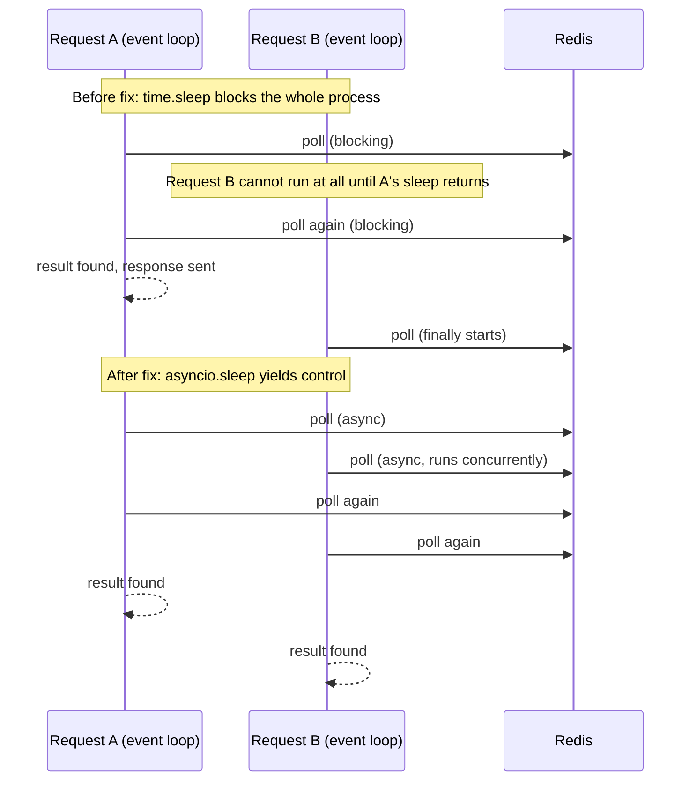

# Feature: Background Workers and Redis (Domain 12)

## Fixed: event-loop-blocking poll (Phase 1 finding, closed here)

`services/ml_service_client.py::get_job_result()` used a blocking `time.sleep(poll_interval)` loop to poll the Redis result cache, and was called **directly from `async def` FastAPI route handlers** (`services/ml_prediction_service.py::predict_url`/`predict_urls`, `services/prediction_service.py::_predict_with_ml_model`, and `routers/ml/ml_training_route.py::get_training_result`) with no `asyncio.to_thread`/`run_in_executor` wrapper. This blocked the **entire ASGI event loop** for up to the request timeout (30s single-predict, 60s batch) on every prediction request — serializing all concurrent request handling in that worker process, regardless of how many other requests were waiting. Flagged in `SEMD_BACKEND_CURRENT_STATE.md` section 8 during Phase 1; closed here.

**Fix**: `get_job_result` and both `predict_url_sync`/`predict_urls_sync` (names kept — see file comment on why) are now `async def`, using `asyncio.sleep` instead of `time.sleep`. All 3 call sites updated to `await`. Individual `redis_client.get_cache()` GET calls remain synchronous (the underlying Redis client is sync, `redis-py` not `redis.asyncio`) — those are sub-millisecond operations, not the dominant blocking cost; the deliberate `poll_interval` sleep (up to 60× per request) was. A fully async Redis client would be more thorough but is a larger `services/client/redis_client.py` rewrite touching every caller across the codebase, not scoped to this fix.

Proven with a concurrency test, not just asserted: `tests/unit/test_ml_service_client_async.py::test_concurrent_polls_do_not_serialize` runs two `get_job_result` calls concurrently via `asyncio.gather`, each needing 2 poll cycles (0.5s apart) to resolve — completes in ~0.5s (concurrent) rather than ~1.0s (serialized), which is only possible if the sleep yields control back to the event loop.

## `workers/prediction_worker.py` — audited, not changed

Standalone process (`make worker`), not part of the ASGI app, so its own `time.sleep(1)` in the error-retry path and blocking `redis_client.pop_from_queue` are fine — it's a dedicated single-purpose polling loop, not sharing an event loop with HTTP request handling. Reviewed against the master prompt's Domain 12 checklist:

| Requirement | Status |
|---|---|
| Graceful shutdown | **Present** — `SIGINT`/`SIGTERM` handled, sets `self.running = False`, checked each loop iteration. Up to 5s shutdown latency (one `poll_timeout` cycle) — acceptable for this use case. |
| Job schema / payload versioning | **Absent.** `result_data` is a raw dict with no `schema_version` field and no validation before use (defensive `.get()` calls with defaults prevent crashes on malformed input, but nothing enforces shape). **Not fixed** — the payload is written by `semd-ml` (a separate repo this session can't modify), so unilaterally adding strict validation here risks rejecting real production messages if the two repos' assumptions ever drift. This is a cross-repo contract that needs coordinated change, not a unilateral fix. |
| Dead-letter handling / retry | **Absent.** `process_result` catches exceptions, logs, and returns `False` — the caller (`start()`) does nothing with that return value. If `redis_client.set_cache` fails (e.g. Redis briefly unavailable), the result is silently dropped forever; the backend's `get_job_result` poll just times out with a generic message, no indication of what actually happened. **Not fixed** — building a dead-letter queue is new infrastructure, not a bug fix; flagged for a dedicated follow-up. |
| Duplicate execution / idempotency | **Fine as-is.** Caching is a plain `SETEX` overwrite — reprocessing the same `job_id` twice has no harmful side effect (last write wins). |
| Worker health | **Absent.** No health endpoint or liveness signal for the worker process itself, only OS-level process monitoring. Building one is new infrastructure — flagged, not built. |
| Unvalidated arbitrary Python objects through queues | **Not an issue** — `services/client/redis_client.py::pop_from_queue`/`get_cache` use `json.loads`/`json.dumps`, not `pickle`, so payloads are JSON-safe by construction (no arbitrary code execution risk via deserialization), even though schema *shape* isn't validated. |

## Testing

`tests/unit/test_ml_service_client_async.py` (new, 2 cases): concurrency proof described above, plus a timeout-returns-`None` regression check. Existing `tests/unit/test_ml_prediction_service.py` and `tests/unit/test_prediction_ssrf.py` continue to pass unmodified — `unittest.mock.patch` auto-detects that the patched methods are now coroutines and substitutes `AsyncMock` automatically, so no test rewrite was needed for the sync-to-async conversion itself.

## Migration / rollback

`git checkout -- services/ml_service_client.py services/prediction_service.py services/ml_prediction_service.py routers/ml/ml_training_route.py tests/unit/test_ml_service_client_async.py`. No DB/schema impact, no client-visible contract change (same response shape, same timeout semantics — only the *mechanism* of waiting changed from blocking to non-blocking).
