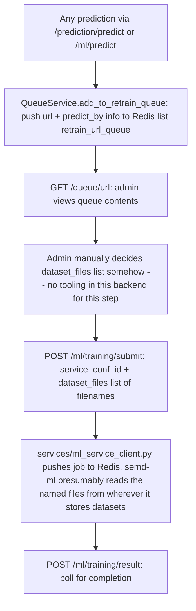

# Feature: Dataset and Retraining Management (Domain 11)

## What actually exists — confirmed, not assumed

Grepped for "dataset" across the entire backend. What exists: `services/queue_service.py` (a single Redis list, `retrain_url_queue`, populated by every prediction call regardless of outcome — see Domain 7's note that this isn't tied to report confirmation), the training-job submission/result/retrain endpoints wired up in Domain 10 (`/ml/training/*`, which take a raw `dataset_files: List[str]` — filenames only, no upload, no validation, no storage model), and one hardcoded `total_dataset: 0` placeholder field in a Domain-9-adjacent stub stat service.

**None of the master prompt's Feature 11 scope exists in this codebase**: no base/queue/current dataset distinction, no dataset metadata model, no upload endpoint, no schema validation, no duplicate detection, no dataset versioning, no configurable retraining threshold, no progress tracking beyond the raw job-result Redis cache already covered in Domain 10, no cancellation. This isn't a bug to fix — it's simply not built. Per the master prompt's prohibition on fabricating requirements, not invented here.

## What the actual (thin) flow looks like

Step D is a real gap: there's no code path connecting "URLs sitting in `retrain_url_queue`" to "the `dataset_files` list submitted to a training job." An admin would have to manually export/prepare files outside this backend entirely. This is the concrete evidence for the "Domain 7 gap" already flagged (report confirmation doesn't feed the retrain queue, and the retrain queue doesn't feed training job submission either) — the three pieces the master prompt assumes are connected are three disconnected pieces of infrastructure today.

## Fixed this pass: privacy leak in the one real endpoint that exists

`GET /queue/url` — the only endpoint that reads `retrain_url_queue` — returned every queued item's `predict_by: {user_id, username, profile_img_url}` to **any authenticated MEMBER**, not just admins. This reveals which URLs other specific users looked up, by name, to anyone with an account. No owner-scoped alternative exists (unlike `/report/me`), and the endpoint's own description ("Shows prediction info with user details") confirms this was always meant to expose identity data, just not to non-admins. Fixed: gated to `AuthGuard.require_admin`, matching this domain's actual character as an internal ops/pipeline-monitoring view rather than a user-facing feature.

## Testing

`tests/unit/test_queue_route_permissions.py` (new, 3 cases): unauthenticated → 401, member → 403, admin → 200.

## Migration / rollback

`git checkout -- routers/queue/queue_route.py tests/unit/test_queue_route_permissions.py`. No schema impact.

## Recommendation for whoever builds this domain for real

Before writing dataset-management code: decide whether `retrain_url_queue` should auto-populate `dataset_files` for a training job (closing the Domain 7/10/11 gap noted above), what a "dataset" even is in this system (a CSV export? a reference to rows in the `prediction`/`url_report` tables? a file on disk that `semd-ml` owns?), and what "eligibility"/"threshold" means for auto-triggering retraining. None of this is inferable from the current code.
