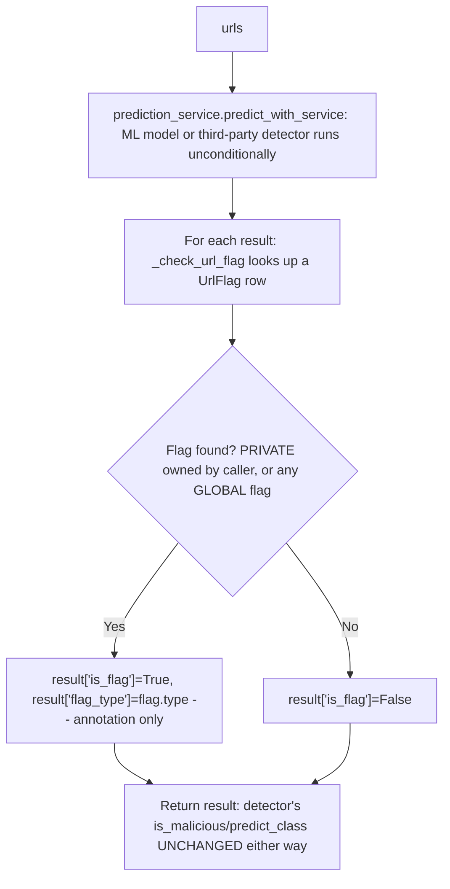

# Feature: URL Flags and Whitelist Rules (Domain 8)

## Critical finding, fixed: any MEMBER could control global URL classification

`UrlFlag.access_level` is `PRIVATE` or `GLOBAL` (`libs/types/enums.py::ACLType`). `check_url_flag`/`check_url_flag_async` (`services/url_flag_service.py`) resolve a flag for `url` as `access_level == GLOBAL OR user_id == caller` — i.e. a `GLOBAL` flag is returned for **every caller**, not just its creator.

Before this pass, `create_flag`, `update_flag`, and `delete_flag` had **zero role checks anywhere** — router, control, and service layers all just checked "does the caller own this specific flag row," with no distinction between `PRIVATE` (personal preference, fine for any member to own) and `GLOBAL` (affects every user's prediction annotation). Concretely, any authenticated MEMBER could:

- `POST /setting/url-flag` with `access_level: GLOBAL, type: BENIGN` for a known-malicious URL — annotating it as flagged-benign for every user.
- Same for `type: MALICIOUS` against a legitimate URL.
- Once created, **only that same member** could edit or delete it — not even an admin had an override, so a rogue global flag was only removable by its own creator or direct DB access.

Fixed in `services/url_flag_service.py`: `create_flag` requires `role in (ADMIN, SUPER_ADMIN)` when `access_level == GLOBAL`; `update_flag` requires admin if the flag is or is being made `GLOBAL` (covers both "edit an existing global flag" and "promote my private flag to global"); `delete_flag` now allows admin-or-owner (previously owner-only), closing the "nobody but the creator can remove a rogue global flag" gap. `routers/setting/url_flag_route.py`'s 6 methods had the same missing-`except HTTPException`-guard issue as every other domain audited so far (and additionally, `PermissionDeniedError` isn't an `HTTPException`, so even the two methods that *did* have the guard would have mangled the new check) — all 6 swept.

## Precedence — documented from actual code, not assumed from the master prompt's example flow

The master prompt's Feature 5 flowchart implies: check user flag → if present, apply it (short-circuit) → else check global rule → else run the detector. **That is not what this codebase does.** Traced `control/prediction_control.py::predict()` exactly:

**The detector always runs, and its `is_malicious`/`predict_class` output is never overridden, suppressed, or replaced by a flag.** A flag is surfaced as auxiliary metadata (`is_flag`, `flag_type`, `flag_id`) alongside the unmodified detector result — the actual "does this URL get treated as malicious" decision is made entirely by whichever detector ran, every time, regardless of any user or global flag.

Whether this is a bug (flags were meant to override/short-circuit, per the master prompt's assumed design) or intentional (flags are informational-only, and overriding happens client-side, or via a different mechanism not yet built) **cannot be determined from the code alone** — there's no comment, test, or other documentation indicating which. Flagged here rather than guessed at; not changed in this pass, since "make flags authoritative" vs. "leave them informational" is a product decision with real behavioral consequences (e.g., does a global whitelist entry mean "never call the detector for this URL" — cheaper and faster — or "always call it, but tag the result"?).

**Sub-precedence among flags, as implemented**: if both a `PRIVATE` flag (owned by the caller) and a `GLOBAL` flag exist for the same URL, `check_url_flag`'s `.first()` (no explicit `ORDER BY`) returns whichever row the database happens to return first — **undefined, not a deliberate PRIVATE-beats-GLOBAL or GLOBAL-beats-PRIVATE precedence**. If both matter, this needs an explicit tie-break (e.g., prefer PRIVATE, since it's a more specific/intentional per-user override) — not fixed here since it's the same "needs a product decision" category as the override question above, and no test or evidence indicates two conflicting flags is a real scenario worth prioritizing yet.

## Minor, not fixed: dead conditional in `check_url_flag_async`

Line's `UrlFlag.access_level.cast(...) == ACLType.GLOBAL.value if False else text("access_level::text = 'GLOBAL'")` — the `if False else` means the first branch never executes; it's debugging leftover that always evaluates to the `text(...)` branch. Functionally correct (verified: the DB-level Postgres enum cast to compare against the literal string `'GLOBAL'` works), just confusing to read. Not touched — cosmetic, not a behavior change, and rewriting SQLAlchemy `text()` clauses carries more risk than the readability gain justifies in this pass.

## Testing

`tests/unit/test_url_flag_permissions.py` (new, 7 cases): member blocked from creating/promoting/editing a GLOBAL flag; member can still create a PRIVATE flag; admin can create/edit GLOBAL flags; admin can delete another user's GLOBAL flag; a non-owner non-admin still can't touch someone else's PRIVATE flag (baseline, unchanged behavior).

## Migration / rollback

`git checkout -- services/url_flag_service.py routers/setting/url_flag_route.py tests/unit/test_url_flag_permissions.py`. No schema change. Client-visible change: `POST`/`PUT /setting/url-flag` with `access_level: GLOBAL` now returns `403` for non-admin callers where it previously succeeded — a documented, intentional security fix, not a contract addition.
