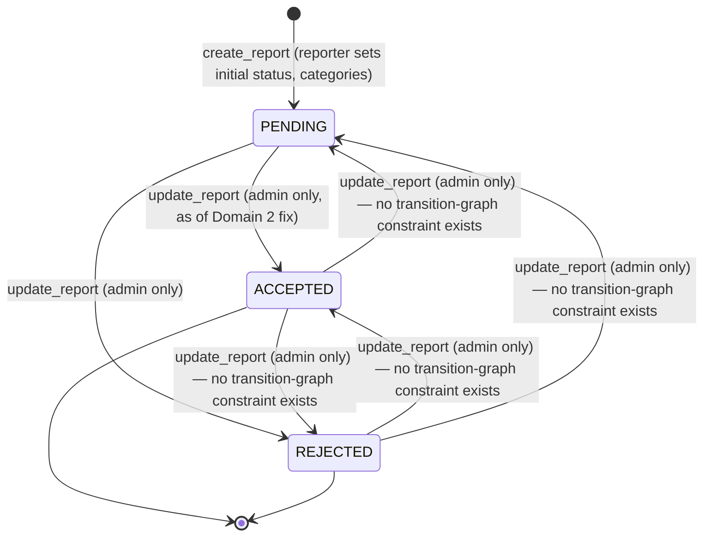

# Feature: URL Reports (Domain 7)

## Relationship to Domain 2

The object-level authorization fix (ownership + admin-gated status changes) and the error-handling sweep for this domain's router were both already done in Domain 2 (`docs/backend/features/users-roles-permissions/README.md`), because the IDOR bug was discovered while building that domain's permission matrix and needed a working error-handling path to actually surface the fix's 403s correctly. This document covers what's left: the state model (Feature 7's specific charter) and one gap found while tracing it.

## State model (as implemented — not the master prompt's example)

`libs/types/enums.py::ReportStatusType` has **3** states, not 4: `PENDING`, `ACCEPTED`, `REJECTED`. There is no `ConfirmedMalicious`/`ConfirmedBenign` split — a single `ACCEPTED` state covers both, with the actual malicious/benign classification living in a separate field (`UrlReport.categories`, a `FlagType`: `MALICIOUS`/`BENIGN`), set independently of `status` and not constrained to change together.

**Finding**: `update_report` (post-Domain-2-fix) restricts *who* can change `status` (admin/owner-of-report, status changes admin-only) but does not restrict *which* transitions are valid — an admin can move a report from `REJECTED` back to `PENDING`, or `ACCEPTED` to `REJECTED`, or any other combination, since there's no transition-graph validation, only a permission check. Every action is recorded in `url_reported` (the audit-history table) regardless of transition validity, so the history is fully auditable even if the transitions themselves aren't constrained. **Not fixed in this pass** — restricting transitions (e.g., "final states are terminal") is a business-rule decision, not something derivable from the code; flagging rather than inventing a state machine the product doesn't currently define.

## Gap found: "dataset-queue eligibility" (master prompt's Feature 7 scope) does not exist

The master prompt's Feature 7 scope lists "Dataset-queue eligibility" as part of this domain — implying a confirmed/accepted report should feed the ML retraining dataset queue. Traced `services/queue_service.py::add_to_retrain_queue` (the only retrain-queue writer in the codebase): it's called from `control/prediction_control.py::predict()` **on every single prediction**, completely independent of `url_report`/`url_reported`. There is no code path anywhere that pushes a URL to the retrain queue *because* a report was accepted/rejected. The retrain queue's actual trigger is "a prediction happened," not "an admin confirmed a report." This is either an unbuilt feature or a different design than the master prompt assumed — not something this audit can safely build without a specification of the intended eligibility rule (age threshold? report count? confidence score?). Flagged for Domain 11 (Dataset and Retraining Management), which owns this queue's actual audit.

## Testing

Covered by Domain 2's `tests/unit/test_url_report_permissions.py` (ownership + admin-status-change enforcement) and the error-handling regression already in `tests/unit/test_url_report_permissions.py`'s call path via `report_route.py`. No new tests needed for this document's findings — the state-diagram and dataset-queue gaps are documentation/flags, not code changes.

## Nothing changed in this pass

This domain's code was already touched in Domain 2. No new files modified here — this document exists to satisfy Feature 7's specific documentation charter (state diagram) and to record the dataset-queue-eligibility gap where it's actually owned.
