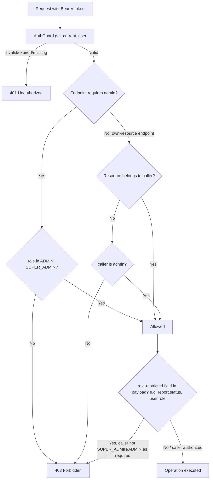

# Feature: Users, Roles, and Permissions

Consolidated feature doc (README + current/target-flow + api-contract + database-model + security + testing + migration-notes in one file) rather than the full 9-file split — this domain has no state machine or complex request/response variance to warrant separate files; splitting further would be empty scaffolding, not documentation. Source diagram also kept at `diagrams/authorization-flow.mmd`; rendered inline below.

## Authorization flow

## Purpose

User accounts, role-based access, and object-level authorization across the backend. Not a standalone router set — `RoleType` and the permission checks documented here are enforced piecemeal across `routers/auth/user_route.py`, `routers/setting/*.py`, and (as of this pass) `services/url_report_service.py`.

## Actors / roles

`libs/types/enums.py::RoleType`: `GUEST`, `MEMBER`, `ADMIN`, `SUPER_ADMIN`.

**`GUEST` is defined but never referenced anywhere in the codebase** (confirmed via repo-wide grep) — no user is ever assigned it, no endpoint checks for it. It's dead code in the enum. Unauthenticated access is handled entirely by `AuthGuard` returning 401 before any role check runs, not by a `GUEST` role. Flagged as unused; not removed (removing an enum value some future admin-seed script might reference is a bigger, unnecessary risk for zero benefit — leave it, don't build on it).

## Permission matrix (as implemented, verified against code — not inferred from docs)

| Action | Public | MEMBER | ADMIN | SUPER_ADMIN |
|---|---|---|---|---|
| Register (`POST /auth/register`) | Yes | — | — | — |
| Login / refresh / logout | Yes | — | — | — |
| View own profile (`GET/PUT /auth/me`) | No | Yes (self only) | Yes (self only) | Yes (self only) |
| Reset own password | No | Yes | Yes | Yes |
| Setup/enable own 2FA | No | Yes | Yes | Yes |
| `GET /auth/users` (list all users) | No | No | Yes | Yes |
| `POST /auth/users` (create MEMBER/ADMIN) | No | No | Yes | Yes |
| `GET/PUT /auth/users/{id}` (any user) | No | No | Yes | Yes |
| `POST /auth/users/{id}/reset-password` | No | No | Yes | Yes |
| `DELETE /auth/users/{id}` | No | No | Yes | Yes |
| `POST /auth/create` (create ADMIN via legacy endpoint) | No | No | No | Yes only |
| Change a user's `role` field | No | No | No | Yes only (`services/auth_service.py:387-390`) |
| Edit/delete a `SUPER_ADMIN` account | No | No | No | Yes only (self-service, `auth_service.py:393,458,481`) |
| Delete own account via admin endpoint | No | No | No | **No** — blocked even for self (`auth_service.py:488`) |
| Create/read/update/delete own API access key | No | Yes (self only) | Yes (self only) | Yes (self only) |
| Admin access-key management (`/setting/access-key/admin*`) | No | No | Yes | Yes |
| System config read | No | Yes | Yes | Yes |
| System config write | No | No | Yes | Yes |
| Create/view own URL report | No | Yes | Yes | Yes |
| **List all reports / view any report by ID** (`GET /report`, `GET /report/{id}`) | No | **Yes — no admin gate** | Yes | Yes |
| Edit own report (non-status fields) | No | Yes (owner only, fixed this pass) | Yes (any) | Yes (any) |
| **Change a report's review `status`** | No | **No (fixed this pass — see Security below)** | Yes (any) | Yes (any) |
| Create/read/update/delete own URL flag | No | Yes (self only, via `get_flags_by_user`) | Yes | Yes |
| Read/update/delete a URL flag by ID (`GET/PUT/DELETE /setting/url-flag/{id}`) | No | **Not independently verified this pass — flagged for Domain 8** | — | — |

Two duplicated inline admin-gate implementations exist, doing the same `role not in [ADMIN, SUPER_ADMIN]` check: `routers/auth/user_route.py::_check_admin_permission`, `routers/setting/system_config_route.py::_check_admin_permission`, `routers/setting/access_key_route.py::_check_admin` (three, not two). No shared dependency/guard function — each router hand-rolls it. Functionally consistent today (all three check the same two roles), but any future role-model change (e.g. adding a scoped `MODERATOR` role) requires editing three files correctly instead of one. **Recommendation, not done this pass** (cosmetic consolidation, not a bug): extract to `guard/auth_guard.py::AuthGuard.require_admin` as a FastAPI dependency, replacing all three.

## Security: object-level authorization (IDOR) findings

**Fixed this pass**: `services/url_report_service.py::update_report` performed *no* ownership or role check before this change — any authenticated MEMBER could edit, and specifically could silently change the review `status` of, any other user's report by guessing/incrementing `report_id`. This bypassed the entire admin-review concept the URL Reports feature is built around. Fix: ownership check (owner or admin required to edit at all) + role check (only admin/super_admin may change `status`). See `core/exceptions.py::PermissionDeniedError`, test coverage in `tests/unit/test_url_report_permissions.py`.

**Flagged, not fixed — requires product confirmation**: `GET /report` (list all reports) and `GET /report/{id}` (read any report) have no ownership or admin gate; any authenticated user can browse every other user's reports. This is either (a) intentional — a crowdsourced/community threat-list design where report *visibility* is meant to be shared while *editing* is not (plausible: a separate `/report/me` endpoint already exists for "just mine", and the endpoint's OpenAPI summary doesn't carry an `[Admin]` tag the way genuinely admin-only endpoints in this codebase consistently do), or (b) the same class of bug as the write path. **Not resolved from code alone — this is the kind of security-sensitive call the execution mandate says to stop and ask about, so it's surfaced here rather than silently decided either way.** Read-only, lower severity than the write-path bug (already fixed), so it doesn't block continuing to other domains.

**Deferred to Domain 8 (URL Flags)**: `control/url_flag_control.py::get_flag`/`update_flag`/`delete_flag` have the identical `(flag_id, db)`-only signature shape that `url_report`'s `get_report`/original `update_report` had before this fix — strong signal the same ownership gap exists there. Will verify and fix when that domain is reached, not assumed fixed here.

## Testing

`tests/unit/test_url_report_permissions.py` — 4 cases: non-owner/non-admin rejected (403), owner can edit non-status fields, owner cannot self-approve a status change (403), admin can change any report's status. Existing auth-domain tests (`test_auth_error_handling.py`) cover the admin-gate 403 shape for `/auth/users/*`.

No dedicated repository-level pagination/filtering tests added for `GET /auth/users` in this pass (out of scope — no bug found there, existing behavior preserved).

## Migration / rollback

Single file changed with behavior implications: `services/url_report_service.py` (+ its router `routers/report/report_route.py`, error-handling only, see below). Rollback: `git checkout -- services/url_report_service.py routers/report/report_route.py tests/unit/test_url_report_permissions.py`.

## Error-handling note (done as a dependency of the IDOR fix, not separately scoped)

`routers/report/report_route.py` had the same 61-site pattern as auth (`except Exception → HTTPException(500, str(e))` on all 5 methods, only 2 of 5 with the `except HTTPException: raise` guard). This had to be fixed in this pass because the new `PermissionDeniedError` (an `AppError`, not an `HTTPException`) would otherwise have been silently caught by the unguarded catch-all and turned into a 500 — meaning the IDOR fix would have shipped broken (403 mangled to 500) without this. Swept all 5 methods (pure passthrough, no `db.rollback()`/logging inside any of them, safe to delete per the auth-domain precedent). This *is* Domain 7 (URL Reports)'s error-handling work, done early — Domain 7's remaining scope is the state-diagram/business-rule verification, not another error-handling pass.
